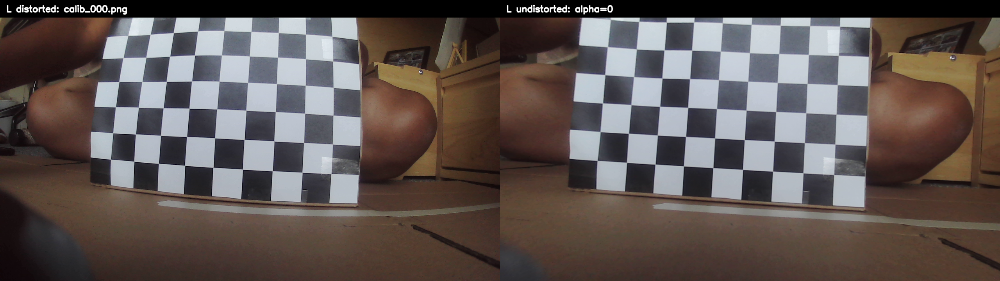
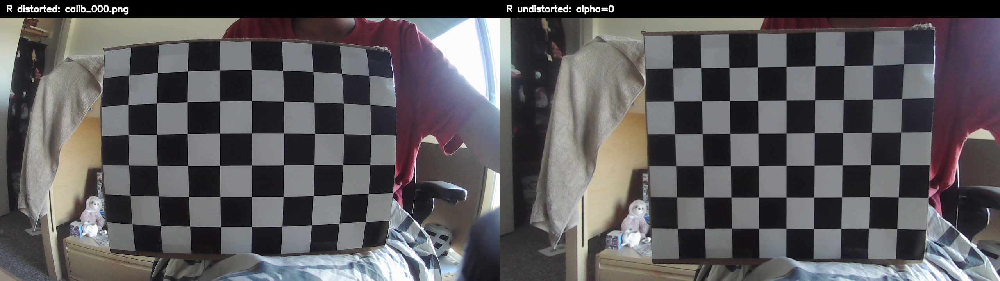
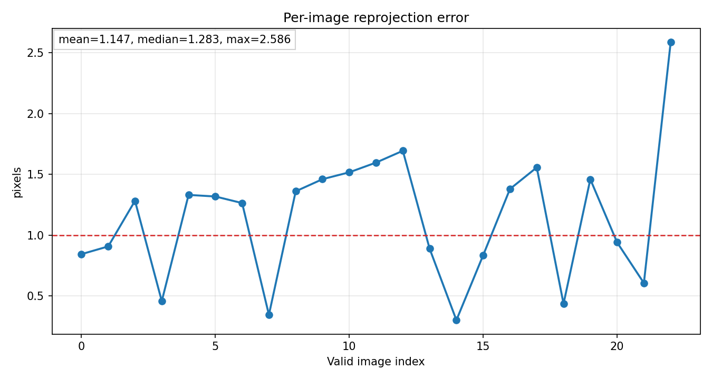
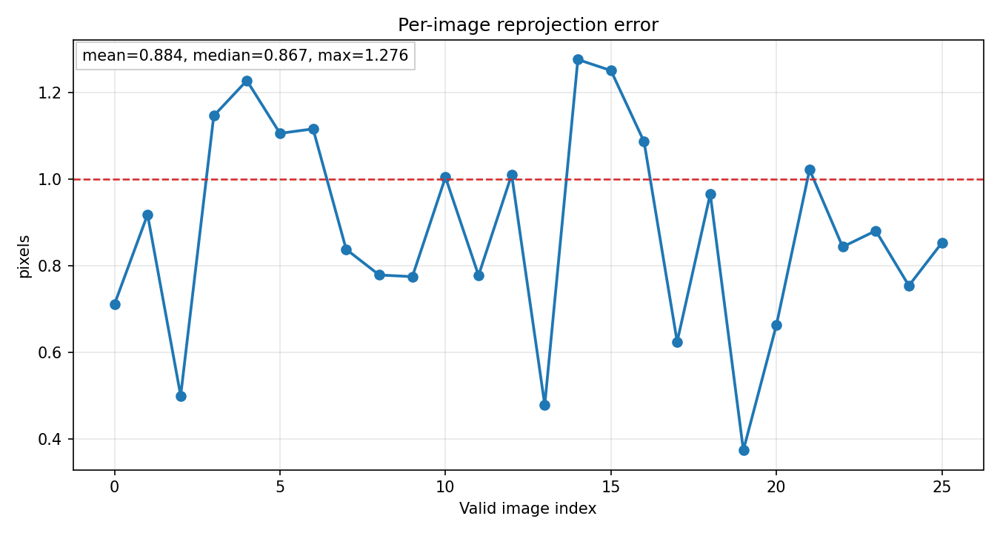
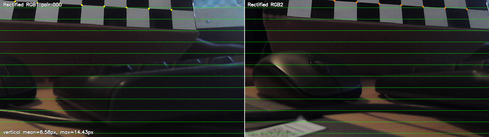
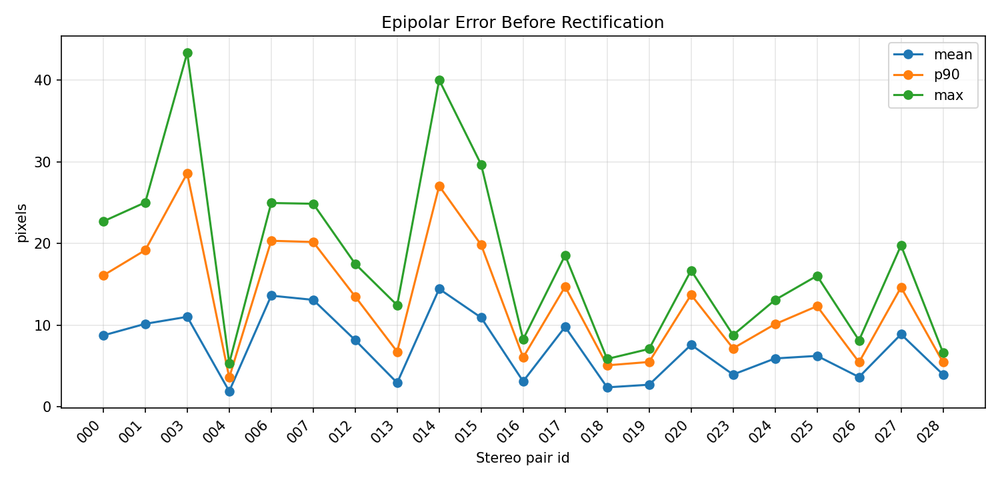
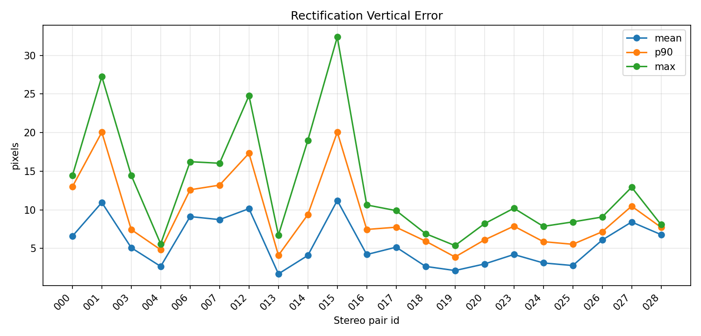
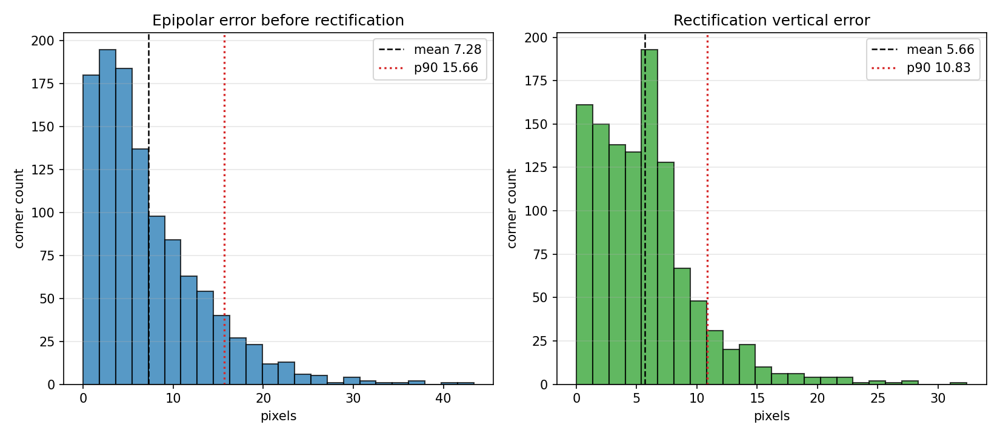

# Checkpoint 2

We set out to evaluate the best configuration of LiDARs and cameras to mount on an excavator so we could accurately capture the volume of material excavated, localize where excavation happened, and reconstruct the terrain over time. Full-scale field trials were not feasible within our budget and timeline, so we prototyped on a **1:18-scale toy excavator** using **two low-cost RGB cameras** and **one inexpensive 360° 2D LiDAR** purchased online. Scale quickly became the central problem: at toy dimensions, these sensors only delivered on the order of **±50 mm** accuracy and effectively required a **much larger excavation** than our sandbox could provide before depth and volume estimates became meaningful. While conversations with construction professionals revelaed that current earthwork progress tracking often needs accuracy on the order of **0.1 sq ft (92.9 sq cm)**, in order to use this platform for autonomous or teleoperation purposes this peception system needs to operate with milimeter level accuracy. 

## Constraint: 

**How do you validate that a physical perception pipeline works when you cannot afford sensors or a testbed that meet real-site requirements?** For this checkpoint we **evaluate and document failure mechanisms** across sensor placement, calibration, and depth-estimation strategies so we gain insight into how experiments should be run under tight budget and scale constraints.

---

## What we are trying to learn

| Question | Why it matters |
|----------|----------------|
| Can cheap RGB + 2D LiDAR produce **metric** geometry at toy scale? | Volume and heatmaps need stable depth in meters. |
| Does **calibration quality** or **depth algorithm choice** dominate error? | Tells us whether to spend budget on sensors vs. software. |
| What fails first at small scale: **coverage**, **extrinsics**, or **sensor noise**? | Guides the next round of experiments and documentation. |

---

## Hardware and platform

| Component | Role | Notes |
|-----------|------|--------|
| 1:18 toy excavator | Physical testbed | Small workspace (~860 mm field in ground-truth plan); limits baseline and excavation size. |
| 2× InnoMaker U20CAM-1080P RGB | Stereo pair | 1280×720; indices 0 and 1. |
| Slamtec **RPLIDAR C1** | 2D 360° scan | USB serial; used for validation overlays, not full 3D structure. |
| Printed checkerboard | Calibration target | 10×7 squares, 25 mm per square (250 mm board width for LiDAR segment constraint). |

**Documented hardware failure (Test 1 — `Hardware.md`):** We initially used a **2D LiDAR only** (no 3D volume in the scan plane). The unit **fit physically** on the toy excavator, but it **does not observe depth along the vertical axis** needed for scoop and terrain geometry without additional sensing or motion.

---

## Hardware Calibration

### 1. RGB intrinsics (`01_rgb_calibration/`)

**System design intent:** each RGB stream must first become a stable metric pinhole camera. Without this, every later stereo, LiDAR overlay, and point-cloud step inherits lens distortion as geometric error.

| Camera | Images / detections | Coverage | Reprojection mean / p90 | Notes |
|--------|---------------------|----------|--------------------------|-------|
| L / RGB1 | 23 / 23 | 76% | 1.147 / 1.589 px | Usable, but a few higher-error poses remain. |
| R / RGB2 | 26 / 26 | 100% | 0.884 / 1.187 px | Stronger frame coverage and lower reprojection error. |

Key calibration evidence:






The design decision after Stage 01 is to keep normal pinhole intrinsics as the downstream default because they integrate directly with OpenCV stereo and LiDAR projection, while retaining fisheye calibration as a diagnostic alternative.

### 2. Stereo extrinsics RGB1 to RGB2 (`02_stereo_calibration/`)

**System design intent:** stereo calibration should turn two individually calibrated cameras into a rectified metric baseline. This is the gate before trusting disparity or a `Q`-matrix point cloud.

| Metric | Result |
|--------|-------:|
| Evaluated stereo pairs | 21 |
| Baseline | 0.0540 m |
| Stereo RMS calibration error | 21.703 px |
| Epipolar error before rectification, mean / p90 | 7.278 / 15.663 px |
| Rectification vertical error, mean / p90 | 5.660 / 10.832 px |

Key stereo evidence:






The Stage 02 result is intentionally treated as a system warning, not a final success: the short toy-scale baseline and remaining rectification error make dense metric depth fragile. This justifies using LiDAR as an independent cross-check and documenting failure modes before scaling to excavation-volume claims.

### 3. LiDAR ↔ RGB1 extrinsics (`lidar_camera_calibration/`)

- Captured **synchronized RGB + LiDAR** pairs with checkerboard visible (`01_capture_rgb_lidar_pairs.py`).
- Estimated checkerboard plane from RGB (`02_detect_checkerboard_pose.py`).
- Selected LiDAR returns on the board; enforced **known board edge length** (250 mm width) (`03_select_lidar_board_points.py`, `calibration_settings.py`).
- Tuned **manual** 6-DOF overlay (`04_manual_lidar_camera_overlay.py`).
- **Optimized** extrinsics with point-to-plane + segment endpoint constraints (`05_optimize_lidar_to_camera_extrinsics.py`).
- Validated reprojection overlays (`06_validate_lidar_projection.py`, `07_live_lidar_rgb_overlay.py`).

**Intent:** Put 2D LiDAR scans in the same frame as RGB for overlay and independent depth cross-check.

**Known limitation (documented in README):** A single 2D scan line gives points on a plane intersection, not a full 3D target—optimization is **under-constrained** without diverse poses.

### 4. End-to-end capture + depth pipelines (`stereo_lidar_pointcloud/`)

Per-run folder layout: `outputs/runs/<timestamp>_<label>/` (see `outputs/README.md`).

| Step | Script | Output |
|------|--------|--------|
| Capture RGB1, RGB2, LiDAR | `01_capture_one_set.py` | `capture/rgb1.png`, `rgb2.png`, `lidar_scan.csv` |
| OpenCV stereo depth | `02_make_stereo_pointcloud.py` | `disparity.npy`, `stereo_pointcloud*.ply` |
| Depth Anything V2 (optional) | `02_make_depth_anything_pointcloud.py` | Metric depth scaled from OpenCV reference |
| FoundationStereo (optional, CUDA) | `02_make_stereo_pointcloud_foundation.py` | Learned disparity vs OpenCV |
| LiDAR validation | `03_validate_with_lidar.py` | `validation/lidar_stereo_error_metrics*.json` |
| Qualitative review | `04_view_pointcloud.py`, `05_project_lidar_overlay.py`, `compare_stereo_methods.py` | Overlays and method comparison |

**Three depth strategies tested on the same rectified pair:**

1. **OpenCV** — StereoBM tuned for low texture (`--method stereobm`) or SGBM / optical flow.
2. **Depth Anything V2** — Monocular dense depth on RGB1, scaled to meters using OpenCV depth on the same frame.
3. **FoundationStereo** — Learned stereo.

---

## Quantitative results (LiDAR vs stereo, toy-scale scenes)

Validation compares the **downsampled stereo point cloud** to **2D LiDAR points** transformed into the **rectified RGB1 frame** (`03_validate_with_lidar.py`). Lower median error (meters) means better agreement—not necessarily “production accurate.”

| Run | Scene / method | OpenCV disparity coverage | Stereo points (downsampled) | LiDAR points | Median error | RMSE | Notes |
|-----|----------------|---------------------------|----------------------------|--------------|--------------|------|--------|
| `20260521_222300_legacy_import` | Legacy import, StereoBM (`stereobm`) | ~15.3% | 6,548 | 385 | **0.65 m** | 2.12 m | Max error spike to ~9.15 m on outliers |
| `20260521_235229_carpet` | Carpet scene, StereoBM (`stereobm`) | ~4.3% | 1,204 | 406 | **0.84 m** | 0.87 m | Very sparse stereo coverage on textureless surface |
| `20260521_235229_carpet` | + Depth Anything V2 | 100% depth pixels | 2,253 (downsampled) | — | *(run `03_validate_with_lidar.py --stereo-suffix _dav2` for metrics)* | — | Metric scaling fit **correlation ≈ −0.05** (`depth_scaling_dav2.json` in run folder). Weak alignment to OpenCV/LiDAR. |
| `20260521_222300_legacy_import` or `20260521_235229_carpet` | + FoundationStereo | *(after Windows run)* | *(after Windows run)* | 385 / 406 | *(pending)* | *(pending)* | Requires **Windows + NVIDIA CUDA**. Copy the run folder from Mac after OpenCV step. Outputs: `disparity_foundation.npy`, `stereo_pointcloud_downsampled_foundation.ply`, `validation/lidar_stereo_error_metrics_foundation.json`. Not run in repo yet. |


## Failure methods

Our LiDAR versus stereo checks show median errors near **0.65 - 0.84 m** on a workspace roughly 1 meter across. The main causes fo rfailure are below. They usually stack together.

1. **Scale versus sensor accuracy.** Our budget RGB cameras and 2D LiDAR have limited resolution and noticeable noise. On the 1:18 rig, errors of about **±50 mm** (worse after fusion) are large compared with the size of a scoop or cut. Useful signal only appears when the disturbed volume is much larger than our sandbox. 

2. **2D LiDAR geometry.** The sensor records one horizontal slice. It cannot see vertical relief or the full 3D shape of the scoop or pile. Our fusion step treats that slice as if it represented a cross section of a volume.

3. **Sparse stereo on low texture.** On carpet like scenes with repeating texture, classical stereo recovers depth in only about **4 - 15%** of pixels. Most of the image has no reliable depth to compare with the LiDAR. Learning-based stereo can help texture.

4. **Small stereo baseline.** The two cameras sit close together on a small platform. That short distance between lenses makes depth from stereo harder to estimate and more unstable at the short ranges we use in a toy setting.

5. **Weak metric scaling for monocular depth.** Depth Anything V2 can fill the full image with depth, but turning that output to actual scale depends on OpenCV stereo as a reference. On our carpet run the scaling fit had almost no correlation with the reference (**about −0.05**). Coverage improved with eyetest.

---

## Key updates

- Modular calibration pipelines: `rgb_calibration/`, `stereo_calibration/`, `lidar_camera_calibration/`.
- Runnable fusion and comparison stack: `stereo_lidar_pointcloud/` with versioned runs under `outputs/runs/`.
- Hardware and calibration-file configuration: `config.yaml`.
- Run metadata and validation summaries: `run_info.json`, `validation/lidar_stereo_error_metrics.json`.

---

## Key runs

**Mac (capture, OpenCV, Depth Anything V2, LiDAR validation)**

```bash
cd stereo_lidar_pointcloud

python 01_capture_one_set.py --label carpet
python 02_make_stereo_pointcloud.py --run latest --method stereobm
python 02_make_depth_anything_pointcloud.py --run latest --reuse-rectified

python 03_validate_with_lidar.py --run latest
python 03_validate_with_lidar.py --run latest --stereo-suffix _dav2 --metrics-suffix _dav2

python compare_stereo_methods.py --run latest
```

Example run ids in this repo: `20260521_235229_carpet`, `20260521_222300_legacy_import`.

**Windows (FoundationStereo on an existing run)**

One-time setup: `powershell -ExecutionPolicy Bypass -File scripts\setup_foundationstereo.ps1` from the repo root.

Copy `outputs/runs/<run_id>/` from Mac after OpenCV has been generated, then:

```powershell
cd stereo_lidar_pointcloud

python 02_make_stereo_pointcloud.py --run 20260521_235229_carpet --method stereobm
python 02_make_stereo_pointcloud_foundation.py --run 20260521_235229_carpet --reuse-rectified

python 03_validate_with_lidar.py --run 20260521_235229_carpet --stereo-suffix _foundation --metrics-suffix _foundation

python compare_stereo_methods.py --run 20260521_235229_carpet
```

Optional compare all methods view: `python 04_view_pointcloud.py --run 20260521_235229_carpet --stereo-backend compare-all --mode stereo`

FoundationStereo is not supported on macOS (CUDA required). Use the same `--run` id on both machines so OpenCV, DA-V2, and Foundation results stay comparable.


