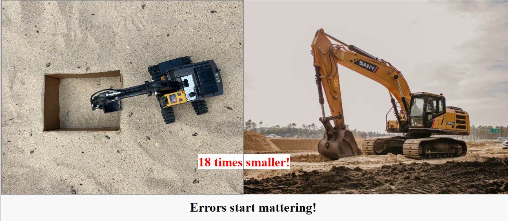
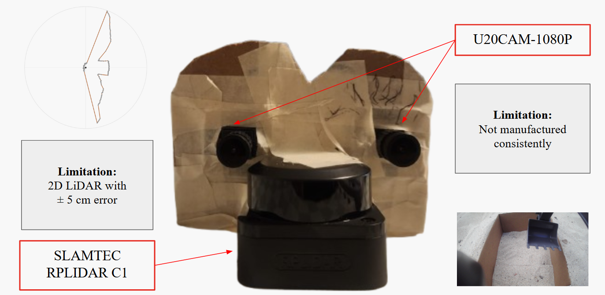

# Edge-Deployable Perception Stack for Earthwork Progress Tracking

**Team:** Ashmitha Jaysi Sivakumar (ashjs@stanford.edu), Yashasvini Gopalan (ygopalan@stanford.edu)

## Background and Setup

 Construction earthwork requires knowing how much material has been moved and where excavation occurred. Full-scale excavator deployment, with industrial sensors, reliable connectivity, and ground truth on every pass, is costly and slow to iterate. So, we wanted to test whether a low-cost, excavator-mounted perception stack could track excavation progress before deploying a larger hardware system on real construction equipment. Instead of starting on a construction site, we built a scaled testbed around a 1:18 toy excavator with two RGB cameras and a 2D LiDAR. The intended use of the toy platform was to evaluate sensing, calibration, and reconstruction algorithms in a lower-risk and lower-cost environment.

The system input is time-synchronized sensor data from the excavator-mounted setup: RGB stereo image pairs and LiDAR scans, and calibration parameters. The desired outputs are metric estimates of excavation progress, which would be measured through terrain contours at a time t.

Our constraint was that the setup had to be cheap, portable, and testable on a small physical platform. This made the project less about proving a production-ready excavation tracker and more about identifying what kind of scaled testbed can produce meaningful evidence for hardware design choices and algorithms.

Our original question was:

**What perception system will be apt for excavation progress tracking?**

As we collected data, and started building out the project, our question became more specific:

**At what sensor accuracy, workspace size, and scale does a small excavator testbed become usable for evaluating algorithms and hardware design?**

The hard part is that, at a 1:18 scale, errors on the order of centimeters became large relative to the scoop size, sandbox size, and expected terrain changes. The 2D LiDAR could only observe a scan plane, stereo depth was unstable because of the short camera baseline and low-texture scenes.