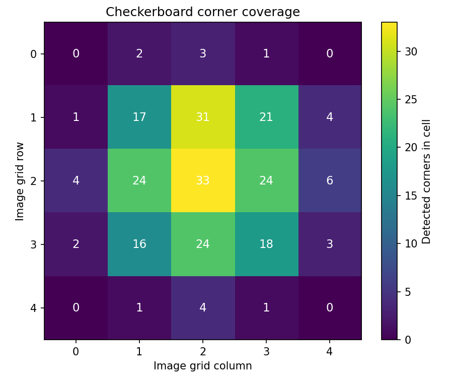
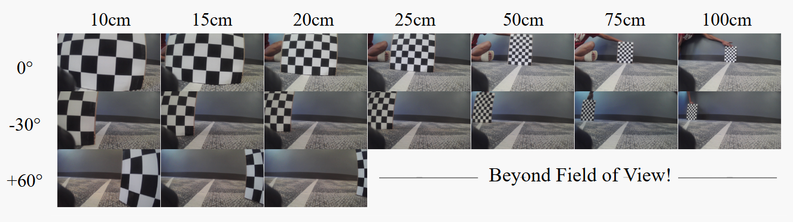
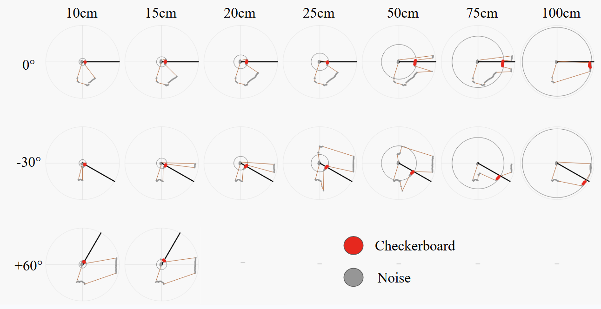
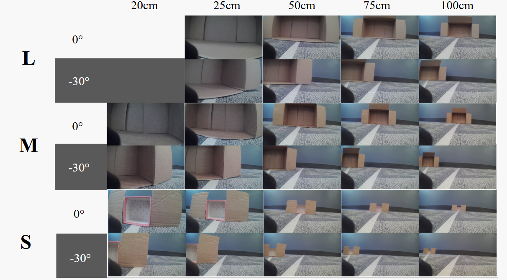

# Data

The calibration and sensor datasets were collected intentionally because all later depth and point-cloud outputs depend on calibration quality. The capture data can be seen in [00_data_capture](../00_data_capture/) and [data](../data/).

## For RGB Transforms

For the RGB intrinsic and stereo transforms, we captured checkerboard images with coverage across the image as shown in Fig. 1. The goal was to expose lens distortion and camera geometry across the whole field of view, not just obtain a few easy detections. We used a printed checkerboard with 9 by 6 OpenCV inner corners and a measured square size of 0.025 m.

**Figure 1.** Checkerboard corner coverage across the RGB calibration images. The dataset was collected to cover the center and most of the usable image area while avoiding extreme border regions that could be cropped during undistortion and rectification.

## For RGB -> LiDAR Transform

For the attempted RGB-to-LiDAR transform, we captured paired RGB images and LiDAR scans of the checkerboard at different known radial distances and angular positions relative to the sensor setup. The intent was to make the target visible from multiple poses so the camera observation and LiDAR scan could be related through a single rigid transform.

**Figure 2.** RGB1 images captured for the LiDAR-camera calibration dataset. The checkerboard was placed at known distances and angles to provide multiple target poses for estimating the RGB-to-LiDAR relationship.

**Figure 3.** LiDAR scan points captured for the same checkerboard placements shown in Figure 2. These points were intended to provide the corresponding 2D range observations for the RGB images.

## For Evaluation

For evaluation, we captured measured volume boxes at different known distances and angles from the sensor setup. These boxes provided simple objects with known dimensions and volumes, which made them useful for checking whether the depthmap produced plausible metric geometry. We also included the checkerboard in this dataset so that the same captures could support calibration checks.

**Figure 4.** Evaluation captures with measured volume boxes placed at different distances and angles. The checkerboard was also included as a calibration and scale reference.

The box dimensions were measured manually before evaluation:

| Size | Length x width x height (cm) | Volume (cm^3) |
| --- | ---: | ---: |
| L | 40 x 24 x 16 | 15,360 |
| M | 26 x 19 x 10 | 4,940 |
| S | 7 x 7 x 6 | 294 |
