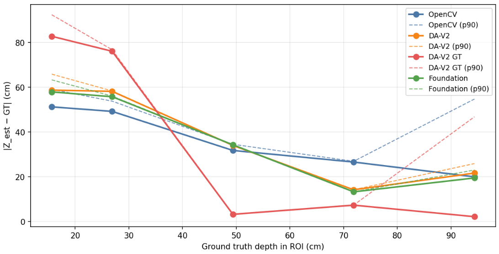
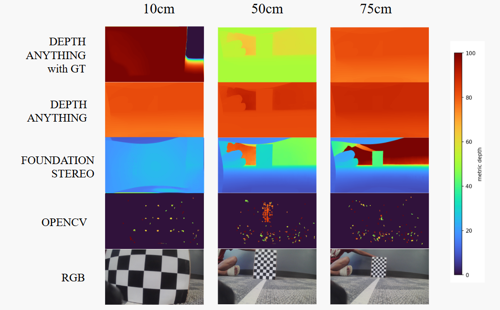
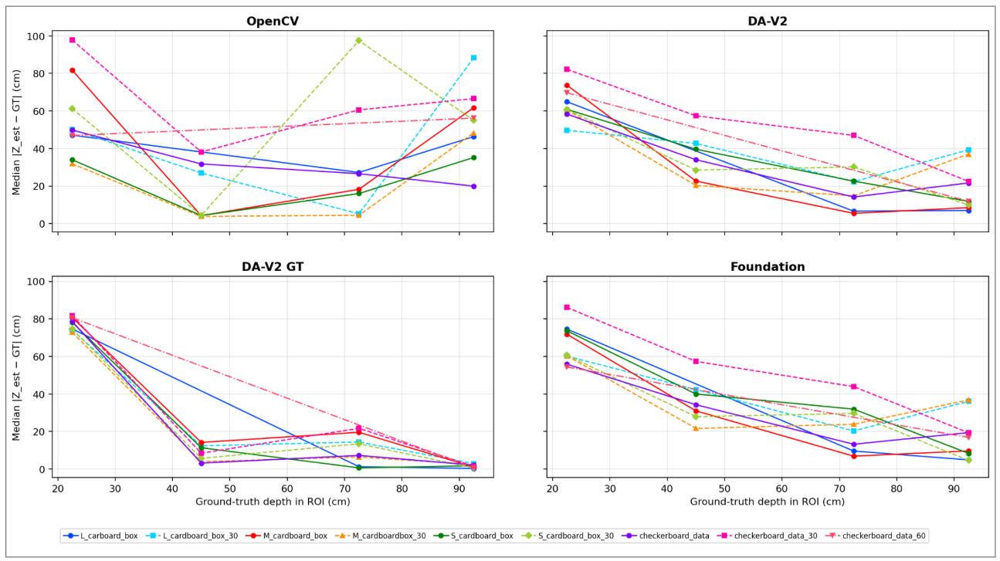

# Depth Map Evaluation

We evaluated the depth maps by defining a region of interest (ROI) around the target object in each image. In future steps, we can define a object detection model for it. But for this setup, we manually label it. The target object was either the checkerboard or a measured cardboard box. Within that ROI, we treated the target surface as the evaluation surface and computed the median estimated depth. The ground truth depth was the measured distance from the sensor setup to the target. This gave a simple metric for each model: how far the estimated depth inside the target ROI was from the measured distance.

**Figure 1.** Checkerboard depth-evaluation setup across increasing measured distances. The x-axis shows increasing ground-truth depth. The y-axis shows the error between the estimated depth and the measured depth, with the mean error shown as solid lines and the P90 error shown as dashed lines.

The plot shows what was good and bad about each method. **DA-V2 with ground-truth anchoring is bad at the closest distances**: its mean and P90 errors are the highest around the first two points, which matches the close-up image where the checkerboard is cropped and dominated by edges. **From about 50 cm onward, DA-V2 with ground-truth anchoring becomes the best mean-error method**, with a very small mean error at the mid and far distances. However, its dashed P90 line increases again at the farthest distance, which means part of the ROI is still failing even when the median/mean surface estimate is good. **FoundationStereo and unanchored DA-V2 behave similarly overall**, especially through the middle distances. **OpenCV is more conservative and sparse**, and its mean error improves gradually with distance but its P90 error grows at the farthest point. Overall, performance improves after the target is far enough to be fully visible because the usable target surface is less cropped and the ROI depth estimate becomes more stable.

**Figure 2.** Depth map outputs from the tested models. The color gradient shows the estimated depth, with the ground-truth distance shown above each example.

The qualitative outputs explain the line plot. At **10 cm**, the checkerboard is too close and partially cropped, so the methods have a hard time estimating a clean target surface. OpenCV produces only sparse valid points, while the learned methods produce dense maps but with poor metric agreement. At **50 cm**, the target is more fully visible. DA-V2 with ground-truth anchoring becomes much more consistent with the measured depth, and FoundationStereo also shows clearer object/background structure. At **75 cm**, the target is visually smaller and closer in depth to the background, so some models begin merging the object with surrounding surfaces. This weak edge separation explains why the P90 error can diverge from the mean: most of the ROI may have a reasonable depth estimate, but boundary pixels or background-mixed pixels create a larger high-percentile error. The color gradient shows the estimated metric depth, with the ground truth shown above each column.

**Figure 3.** Median depth error separated by model and target object. Solid lines correspond to the 0 degree captures, while dotted lines correspond to the 30 degree captures. The x-axis is the measured ground-truth depth in the ROI, and the y-axis is the median absolute error between estimated depth and measured depth.

Figure 3 shows that angle effects are scene-dependent. For the cardboard box scenes, the 30 degree angle is **not worse**. In fact, the average box-scene errors are lower at 30 degrees for most learned models: DA-V2 drops from 46.7 cm at 0 degrees to 39.5 cm at 30 degrees, DA-V2 GT drops from 51.8 cm to 22.4 cm, and Foundation drops from 49.5 cm to 39.3 cm. This suggests the angled view may give the learned models more usable depth cues, visible faces, or stronger object boundaries. We should therefore not claim that angle hurts depth estimation in general; for boxes, the opposite appears true.

The checkerboard scenes behave differently. At 30 degrees, OpenCV becomes much worse, increasing from 40.7 cm at 0 degrees to 73.5 cm at 30 degrees. This means the angle effect depends on target geometry, texture, and model type. The box data suggests angle can help by exposing more object faces, while the checkerboard data suggests angle can destabilize some methods depending on how the planar pattern appears in the image.

Distance has a clearer trend. All methods struggle most in the near band around 15 cm. DA-V2 GT has the highest near error, but becomes extremely strong in the 50cm, 75cm, and 100cm bands: approximately 6.5 cm at 50 cm, 19.4 cm at 75 cm, and 1.9 cm at 100 cm. This suggests GT scaling/alignment helps global scale after the target is far enough to be fully visible, but it does not fix near-field local errors. OpenCV shows the opposite pattern: it is competitive near and mid range, but becomes much worse in the far and very far bands. This matches the stereo geometry issue: at larger distances, disparity becomes smaller, so small disparity errors turn into large depth errors. DA-V2 and Foundation behave similarly, with more stable far-range behavior than OpenCV but still high near-field errors.

Target volume also matters. Larger boxes tend to provide more stable estimates because they occupy more pixels and give the ROI a larger continuous surface. Smaller targets are more sensitive to angle and distance because boundary pixels and background mixing can dominate the ROI. This supports the broader scaling issue in the project: at toy scale, object size, sensor resolution, and depth accuracy are tightly coupled.

Overall model interpretation:

- **OpenCV stereo:** OpenCV is not the worst model in principle. It wins several scenes and is best in the near band. However, it is brittle: its errors spike in some angled scenes and in far/very-far regions. Best characterization: accurate when stereo assumptions hold, but unstable across scene geometry and distance.
- **DA-V2:** DA-V2 is more consistent than OpenCV. It does not always win, but it avoids some of OpenCV's largest failures, improves in 30 degree box scenes, and handles far ranges better. Best characterization: more robust than OpenCV, but not necessarily more accurate in metric scale.
- **FoundationStereo:** Foundation is very close to DA-V2 in aggregate. It is stable, but does not clearly dominate DA-V2 and still has high near-field errors. Best characterization: comparable to DA-V2; stable, but not clearly superior from this dataset.
- **DA-V2 GT:** DA-V2 GT has the best global summary after scaling, especially in mid/far/very-far bands. But it is not uniformly best and performs poorly near the camera. Best characterization: best after GT alignment, especially at farther ranges, but near-field errors remain a major weakness. Since it uses GT scaling/alignment, it should be framed as a calibrated reference rather than a deployable baseline.

**But all models have error margins comparable to the target object dimensions!**
