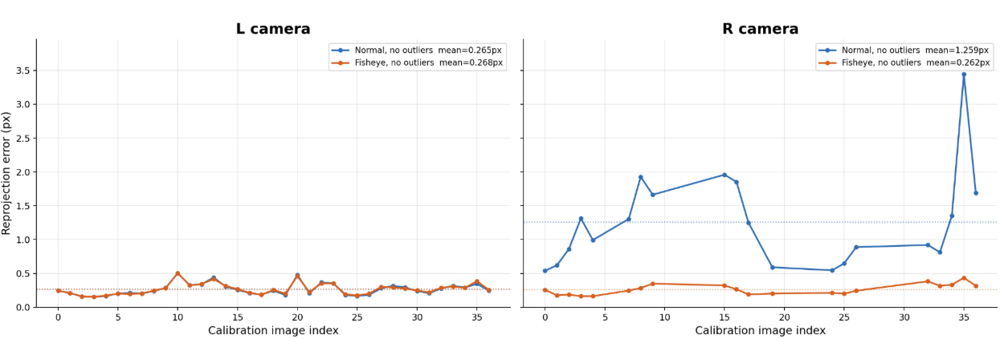
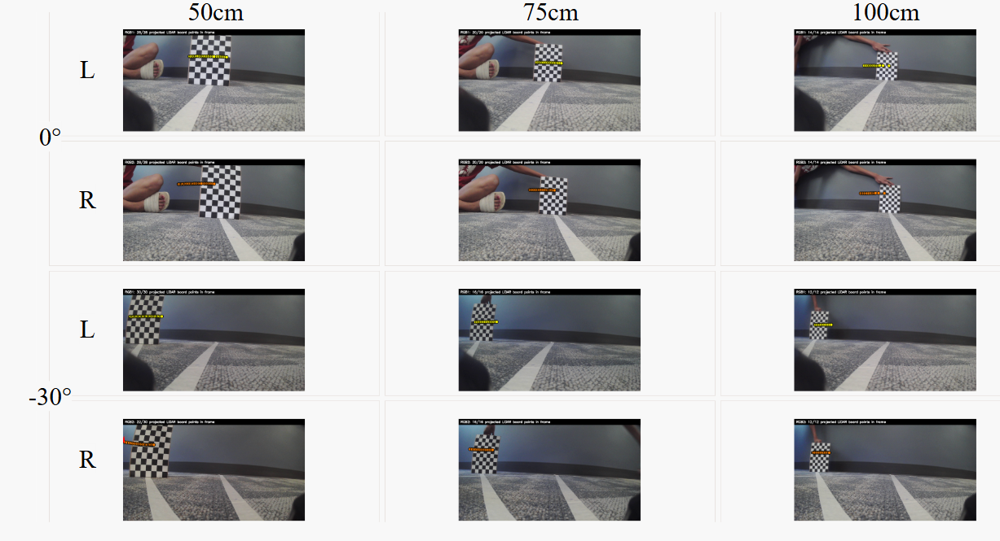

# Transform Evaluation

We evaluated the transform pipeline in three parts: RGB intrinsic calibration, RGB1-to-RGB2 stereo calibration, and the attempted LiDAR-to-RGB1 calibration. The RGB and stereo transforms were evaluated using reprojection, coverage, and rectification metrics. The LiDAR transform was evaluated qualitatively through projected overlays because the setup did not provide reliable ground-truth point-to-pixel correspondences.

## RGB Intrinsic Calibration

The RGB intrinsic calibration was evaluated by checking checkerboard detection coverage, reprojection error, and visual undistortion quality. The final selected intrinsics used the fisheye/no-outlier variants for both RGB-L and RGB-R. It was interesting to note that the RGB-L had similar calibration perfromance for both normal and fisheye but RGB-R had extermely different performance for the two methods. This highlights manufacturing inconsistencies. 

The main metric for RGB intrinsic calibration was **reprojection error**, measured in pixels. After calibration, each known 3D checkerboard corner is projected back into the image using the estimated camera intrinsics and distortion model. The reprojection error is the pixel distance between this projected corner and the detected corner in the real image. Lower values mean the estimated camera model explains the observed checkerboard geometry better. We also report **valid detections** and **grid coverage** because a low reprojection error is less meaningful if the checkerboard was only seen in a small part of the image.

**Table 1.** Evaluation Sumamry for the different calibration tchniques for the RGB-L and R

| Camera | Variant | Model | Images | Valid detections | Grid coverage | Mean reprojection error | P90 reprojection error | Max reprojection error |
| --- | --- | --- | ---: | ---: | ---: | ---: | ---: | ---: |
| **RGB-L** | **normal** | **pinhole** | **37** | **37** | **84%** | **0.265 px** | **0.359 px** | **0.501 px** |
| RGB-L | fisheye | fisheye | 37 | 37 | 84% | 0.268 px | 0.367 px | 0.506 px |
| **RGB-L** | **normal_no_outliers** | **pinhole** | **37** | **37** | **84%** | **0.265 px** | **0.359 px** | **0.501 px** |
| RGB-L | fisheye_no_outliers | fisheye | 37 | 37 | 84% | 0.268 px | 0.367 px | 0.506 px |
| RGB-R | normal | pinhole | 37 | 37 | 72% | 1.658 px | 3.143 px | 3.697 px |
| RGB-R | fisheye | fisheye | 37 | 37 | 72% | 0.291 px | 0.414 px | 0.546 px |
| RGB-R | normal_no_outliers | pinhole | 20 | 20 | 68% | 1.259 px | 1.931 px | 3.444 px |
| **RGB-R** | **fisheye_no_outliers** | **fisheye** | **20** | **20** | **68%** | **0.262 px** | **0.352 px** | **0.435 px** |

**Figure 1.** Comparing the normal and the fisheye reprojection errors in both RGB L and R. the manufacturing inconsistency is visible through the difference in the graphs.

## Stereo Extrinsic Calibration

Stereo calibration was evaluated by checking the estimated baseline, stereo RMS error, epipolar error before rectification, and vertical alignment error after rectification. The key question was whether corresponding points in the rectified images landed on the same image rows, since that is required before computing disparity.

For stereo extrinsics, the core metric was whether the estimated rotation and translation made the two cameras geometrically consistent. **Stereo RMS calibration error** summarizes the average pixel error over the stereo calibration optimization. **Baseline** is the recovered physical distance between the two camera centers; it matters because a short baseline makes disparity less sensitive to depth changes. **Epipolar error before rectification** measures how far corresponding checkerboard points are from satisfying the stereo epipolar constraint before image warping. **Rectification vertical error** measures the remaining y-coordinate mismatch after rectification. This is the most directly relevant metric for stereo depth: after rectification, corresponding points should lie on the same image row, so lower vertical error means the disparity search is better posed.

| Metric | Value |
| --- | ---: |
| Evaluated stereo pairs | 37 |
| Stereo RMS calibration error | 0.712 px |
| Baseline | 0.0732 m |
| Epipolar error before rectification, mean / p90 / max | 0.600 / 1.236 / 5.601 px |
| Rectification vertical error, mean / p90 / max | 0.543 / 1.124 / 5.095 px |

## LiDAR-to-RGB Failure Mode

The attempted LiDAR-to-RGB transform did not work reliably enough to use as a trusted calibration result. The 2D LiDAR observes only a single scan plane, while the RGB cameras observe full images. To align them, we needed reliable ground-truth correspondences between LiDAR returns and image pixels, but our capture setup did not provide those correspondences directly.

For the LiDAR-to-RGB calibration, we could not use the same reprojection-error style metric in a trustworthy way because we did not have ground-truth correspondences between individual LiDAR returns and image pixels. Instead, the evaluation metric became qualitative overlay consistency: after estimating `R_lidar_to_rgb1` and `t_lidar_to_rgb1`, projected LiDAR points should land on the visible checkerboard in RGB-L and RGB-R across different distances and angles. A successful calibration would keep those projected points aligned as the checkerboard moved. Drift across distance or viewing angle indicated that the transform was not reliable.

Our setup depended on filtering LiDAR points based on radial and angular position. However, when the checkerboard was close to the setup, the board was only partially visible in the RGB image, so OpenCV corner detection often failed. Choosing only images where the whole checkerboard was visible made the optimization under-constrained and fragile. In practice, the LiDAR overlay drifted and did not align with the image pixels well enough to be considered a successful metric transform.

**Figure 10.** LiDAR points overlaid on RGB-L and RGB-R images. Drift is visible in RGB-R, and within RGB-L the projected LiDAR points drift as the checkerboard moves farther away and at the 30 degree angular position.

For this reason, we treat LiDAR-camera calibration as a documented **failure mode** of the current approach rather than a reliable component. The main lesson is that LiDAR-camera calibration needs better data collection, explicit correspondences, or a richer geometric target; heuristic alignment alone was not sufficient.
