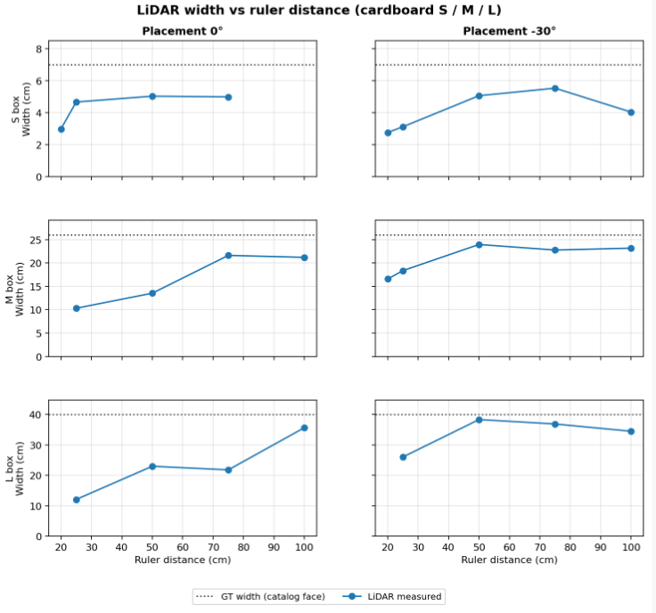
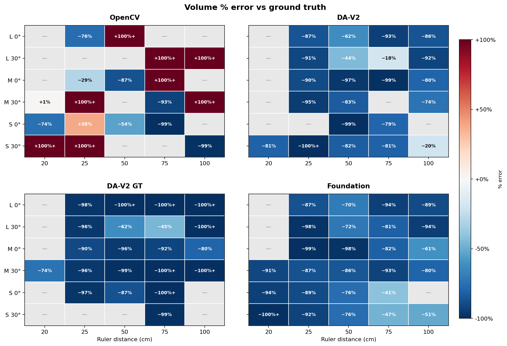
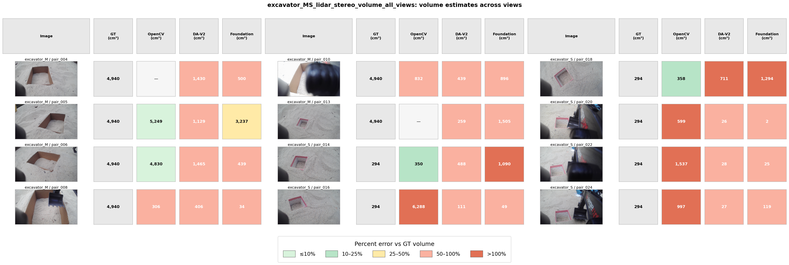

# Volume Estimation Evaluation 

## Method

| Component | Cardboard (Figures 1–2) | Excavator (Figure 3) |
| --- | --- | --- |
| Width | Raw 2D LiDAR face span | LiDAR edge profile, with gate-span fallback if the profile fails |
| Height | Ground truth prior (S = 7 cm, M = 19 cm, L = 24 cm) | Ground truth prior (S = 7 cm, M = 19 cm) |
| Depth | Stereo box flap-to-back: median Z in ROI minus median Z in outside ring | ROI inside/outside heuristics Z from `roi_bbox_volume_estimates` |
| Volume | LiDAR width × ground truth height × depth | Same product |

Ground truth for cardboard uses measured box volumes (S 294, M 4940, L 15360 cm³). 

## Intended use

- Stress-test whether toy-scale LiDAR plus RGB depth carry enough metric signal for known boxes.
- Compare depth methods and placements under manual ROIs.
- Isolate LiDAR width versus bbox width on excavator while holding stereo depth fixed.

## Out of scope

- Production excavation volumetry or progress tracking without trench ground truth.
- Treating near-proxy excavator cells or occasional near-GT cardboard cells as validated volume.
- Using DA-V2 GT as a deployable volume method. 

## Evaluation data

- S/M/L cardboard at 0° and 30°, with multiple ruler distances per scene.
- `excavator_M` and `excavator_S`, six captures each, with range gating via stereo `z_inside` because excavator scenes have no GT ruler.

---

## Results

### LiDAR width

**Figure 1.** LiDAR width versus ruler distance for S/M/L at 0° and −30°. The dotted line is ground truth face width.

| Observation | Detail |
| --- | --- |
| Overall bias | The LiDAR recovers a rough width trend but usually underestimates the true face width. |
| Cause of bias | The face has few scan points, and the measured span depends on where the scan line cuts the box and how clear the edges are in the range profile. |
| Placement angle | −30° works better than 0° for the M and L boxes. |
| M box at −30° | Width stays close to the measured value and is more stable as distance changes. |
| L box at −30° | Width is much closer to ground truth than at 0°. |
| S box | Both angles stay difficult. The true width is small, so the face has too few points and the estimate is resolution-limited. LiDAR width stays below catalog width and barely changes with distance. |

**Summary:** LiDAR width is useful for testing sensing limits but is not reliable enough to use alone. When it is multiplied by depth in the volume formula, both errors combine.

---

### Cardboard volume

**Figure 2.** Signed percent error `(V_est − V_GT) / V_GT` by size, angle, distance, and method (OpenCV, DA-V2, DA-V2 GT, Foundation).

| Metric | Value |
| --- | --- |
| Cells within ±25% of GT | 3 total: M at 30° and 20 cm (OpenCV), L at 30° and 75 cm (DA-V2), S at 30° and 100 cm (DA-V2) |
| Typical error sign | Strong negative, from width underestimate multiplied by thin flap depth |
| Learned methods | They cluster in a narrow underestimation band. DA-V2 GT is often flat after global scaling, so its depth term collapses. |
| OpenCV | It is bimodal. A few cells approach GT, but others overshoot by hundreds of percent when flap depth spikes. A median signed error near +20% reflects those spikes. |

**Summary:** LiDAR width and RGB flap depth do not recover ground truth-accurate volume at toy scale. Near-GT cells are rare exceptions.

**Recommendation:** DA-V2 performs better than current implementation of DA-V2 GT as DA-V2 has more points of references. Anchor DA-V2 with several measured depths at close spacing instead of a single global scale. That may more sensitive to small depth change and recover a more usable box-depth term.

---

### Excavator volume

**Figure 3.** LiDAR width × ground truth height × stereo depth per capture. Cell color shows percent error versus cardboard proxy GT.

| Observation | Detail |
| --- | --- |
| LiDAR width | It is present on M rows but does not stabilize volume. |
| Depth driver | Most scatter comes from stereo depth using the legacy heuristic, not box flap-to-back depth. |
| OpenCV | It is inconsistent across M versus S. It sometimes lands near the proxy on M and can overshoot badly on S (for example pair 016). |
| DA-V2 / Foundation | They keep depth thin and underestimate versus the proxy. |

**Summary:** On excavator captures, LiDAR width does not make volume reliable. Stereo depth still drives most of the error. OpenCV is unstable across trench size, DA-V2 and Foundation stay low.

---

## Limitations

- LiDAR width underestimates ground truth face width, especially for S boxes and 0° placements.
- Flap-to-back depth is often only a few centimeters for learned maps, so volume error grows multiplicatively.
- DA-V2 GT global scaling can flatten ROIs and zero out depth.
- OpenCV disparity noise can produce rare but very large volume overshoots.
- ROIs are currently marked manually.

## Future work

- Add multi-point depth anchoring for DA-V2 and re-evaluate box flap-to-back depth.
- Fix LiDAR–RGB calibration if projecting width into the image is required later.
