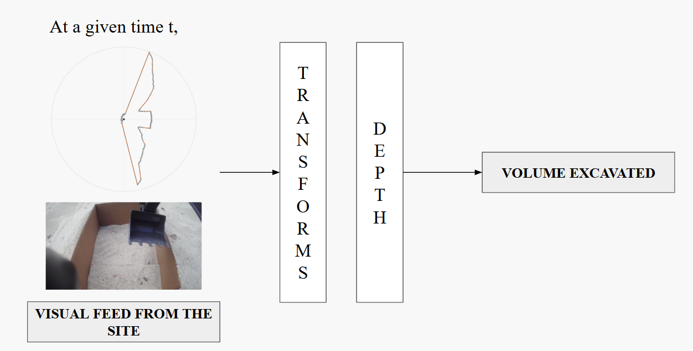
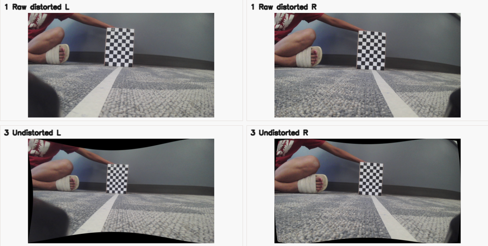
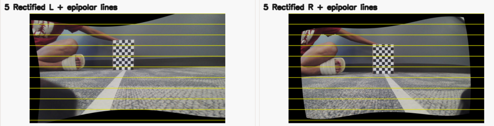

# Transforms

Our project approach had two main parts, shown in Fig. 1:

- First, building a calibrated sensor pipeline that establishes the **transforms** between the different visual inputs.
- Second, using that calibrated data to test three **depth-estimation methods**.

**Figure 1.** The system showing its stages and RGB and LiDAR input data.

# Calibration Pipeline for the Transforms

Before running any depth model, we needed to establish the coordinate transforms that connect raw sensor measurements to metric 3D geometry. The required transforms were:

**Intrinsic transforms**

- **RGB1 intrinsics:** maps RGB1 image pixels to camera rays using the RGB1 camera matrix and distortion model.
- **RGB2 intrinsics:** maps RGB2 image pixels to camera rays using the RGB2 camera matrix and distortion model.

**Extrinsic transforms**

- **RGB1 to RGB2 stereo extrinsics:** rotation and translation between the two RGB cameras, used to rectify the stereo pair and compute metric depth from disparity.
- **LiDAR to RGB1 extrinsics:** attempted rotation and translation from the 2D LiDAR frame into the RGB1 camera frame, intended for projecting LiDAR points into image space.

The calibration datasets for these transforms are described separately in [Data](Data.md).

## 1. Intrinsic Transforms: RGB1 and RGB2 Pixels to Camera Rays

We first calibrated each RGB camera independently. The intrinsic calibration estimates the camera matrix and lens distortion parameters:

- `camera_matrix`: focal lengths and principal point.
- `dist_coeffs`: lens distortion coefficients.
- `image_size`: image resolution used for calibration.
- `checkerboard_size`: number of detected inner corners.
- `square_size`: physical checkerboard square size in meters.

We tested both normal pinhole and fisheye camera models, and we also tested variants with and without outlier image removal. Outliers were defined using reprojection error, then the camera was recalibrated after removing high-error images. The final chosen configuration files in [config.yaml](../config.yaml) select the intrinsics used by later steps.

Checkerboard visibility was important for the RGB intrinsic calibration. OpenCV could only use an image if the internal checkerboard corners were visible and detected reliably, so images with partial board visibility, heavy blur, or ambiguous corners were not useful even if they looked visually informative. We therefore treated checkerboard visibility as part of the data collection method: the board had to appear at different positions, tilts, and distances, but still remain clear enough for consistent corner detection.

**Figure 2.** The distorted vs. undistorted images of the RGB L and R shows how the wall gets straightened from being curved.

Parameters not fully tested:

- Repeating the whole calibration under different lighting conditions.

## 2. Extrinsic Transform: RGB1 to RGB2 Stereo Geometry

After calibrating the two cameras independently, we estimated the stereo transform between RGB1 and RGB2. This step estimates the rigid transform between the two camera coordinate frames:

- `R`: rotation from one camera frame to the other.
- `T`: translation between the cameras, which defines the stereo baseline.
- Rectification transforms: image warps that align corresponding points on the same image row.
- `Q`: reprojection matrix used to convert disparity into 3D metric points.

The stereo dataset also had to be collected carefully. Both cameras needed to see the same checkerboard at the same time, with enough pose diversity to estimate the camera-to-camera transform. We used fixed intrinsics from the RGB calibration step and solved for stereo extrinsics. The downstream depth methods all use the same rectified RGB1/RGB2 images so that the input geometry is consistent across models.

**Figure 3.** Rectified RGB-L and RGB-R images after distortion correction. The rectification step aligns the two camera views so corresponding points lie on the same image rows before stereo disparity is computed.

Parameters tested:

- Fisheye stereo calibration with fixed RGB intrinsics.
- Outlier stereo pair filtering based on checkerboard detection and corner quality.
- Visual rectification checks using numbered checkerboard corners. This step was crucial because the calibration depends not only on detecting checkerboard corners, but on assigning them in the same order across the left and right images. Early calibration attempts produced errors because some checkerboard corners were effectively misordered/mismatched, so we added a visual check that overlaid corner numbers on the stereo image pairs before trusting the calibration.

Parameters not fully tested:

- We did not test different physical baselines.
- We did not tune every downstream OpenCV stereo parameter jointly with calibration. The main untuned parameters were `numDisparities`, `blockSize`, `minDisparity`, `uniquenessRatio`, `speckleWindowSize`, `speckleRange`, `disp12MaxDiff`, and the SGBM smoothness penalties `P1` and `P2`. 
- We also did not fully test all OpenCV stereo variants including `MODE_SGBM`, `MODE_HH`, `MODE_SGBM_3WAY`, and `MODE_HH4`. 

## 3. Attempted Extrinsic Transform: LiDAR to RGB1

We attempted to calibrate the 2D LiDAR into the RGB1 camera frame so that LiDAR points could be projected into the camera image and used as an additional geometric reference. The intended transforms were:

- `R_lidar_to_rgb1`: rotation from LiDAR coordinates into RGB1 coordinates.
- `t_lidar_to_rgb1`: translation from LiDAR coordinates into RGB1 coordinates.
- Checkerboard plane estimates from RGB using `solvePnP`.
- Selected LiDAR returns believed to lie on the checkerboard.

The calibration attempt used the checkerboard as the shared target between RGB and LiDAR. Our heuristic was to use the known radial distance and angular placement of the checkerboard to choose the LiDAR returns corresponding to the board. We also used the known checkerboard dimensions to bias the selected LiDAR segment toward the expected physical length. The intended optimization was then to find `R_lidar_to_rgb1` and `t_lidar_to_rgb1` that made the selected LiDAR points agree with the checkerboard plane estimated from RGB.
