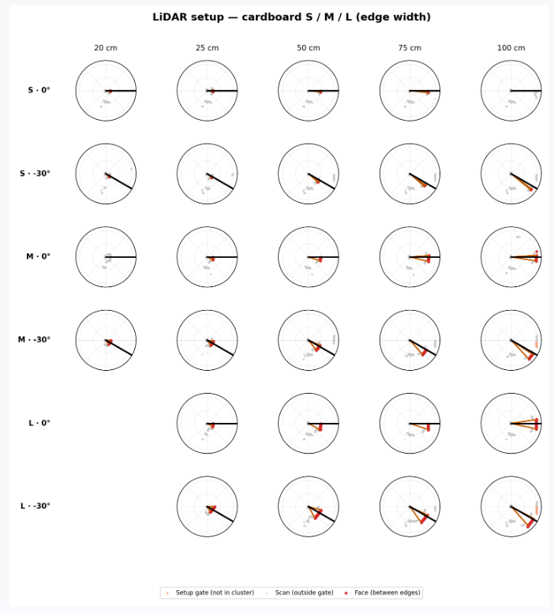

# Volume Estimation

After estimating depth, we used a simple box-volume heuristic. This is **not** meant to be a deployable or generalizable volume-estimation method. Instead, it is a diagnostic experiment: we wanted to understand whether the raw LiDAR point resolution was sufficient to estimate object width, and how that width estimate compared with a projected/manual width prior. Coupled with the depth estimated from RGB depth maps, this gives a controlled way to study whether the sensing setup can recover enough metric information to approximate the volume of known cardboard boxes.

## Method

The estimate combines three quantities:

1. **Depth from the RGB depth map.** We manually label an ROI around the visible box face. The box depth is estimated as the difference between the median depth inside this ROI and the median depth in a nearby outside ring. This approximates how far the box extends along the camera view axis.

2. **Height from measured priors.** Height is not inferred from the image. We use the measured height for each box size:

| Size | Height prior |
| --- | ---: |
| S | 7 cm |
| M | 19 cm |
| L | 24 cm |

3. **Width from either a projected size prior or raw LiDAR.** The default width estimate uses the measured box width corrected by the placement angle, using the 0 degree or -30 degree scene label. This acts as the projected-width baseline. 

As an alternative, we estimate width directly from the raw 2D LiDAR scan, without projecting LiDAR points into the RGB image. This avoids relying on the failed LiDAR-to-RGB calibration. In the LiDAR-only path, we select scan returns near the measured ruler distance and placement angle, then estimate the horizontal span of the box face from the selected range profile as shown below.

 The purpose is therefore not to claim a production volume pipeline, but to test whether LiDAR-derived width plus RGB-derived depth gives a meaningful approximation under controlled box scenes.
